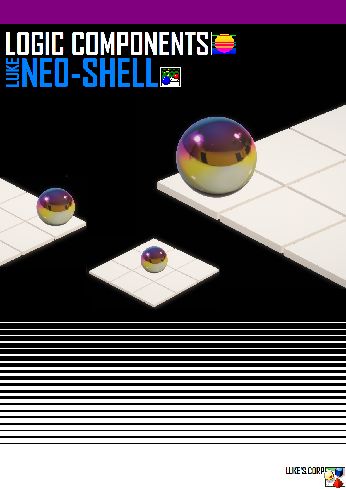

#introduzione Interprete LS-NS# 

brevi parole sul linguaggio:

cos'è?

Il LS-Neo Shell è un linguaggio di programmazione interpretato minimale progettato
con lo scopo per eseguire direttamente su un microcontrollore piccoli pezzi di codice in 
linguaggio NEO-Shell, così togliendo il processo di compilazione
del codice direttamente nella memoria del microcontrollore interessato tra cui 
il fattore tempo della compilazione. 

dove può essere applicato?
tale linguaggio e stato pensato principalmente per essere usufruito in ambienti
di ricerca , laboratorio e sviluppo per la sua estensione nel controllo delle porte 
I/O del microcontrollore e alcuni comandi pensati per il controllo di segnali PWM.

data la sua semplicità e vicinanza ad un ambiente pseudo Basic con derivanti dal C.

il NEO-Shell può essere anche applicato in contesto didattico come strumento 
di studio e apprendimento.

pro & contro

-+- punti a favore -+-

il pro del linguaggio NEO-Shell sta nel rendere la sua programmazione veloce e semplice
abolendo il tempo utilizzato nel compilare il codice da PC a computer, essendo che l'interprete
è installato in memoria.

un altro punto a suo favore e che rispetto a molti linguaggi o interpreti, che in caso sia
presente un comando scritto in modo errato o errore di altro origine , il codice non viene fermato
o bloccato , segnalerà solo il comando che lui non riesce ad interpretare o in casi generici lo
ignorerà proseguendo con l'eseguzione del codice.  

-+- punti a sfavore -+-

essendo un linguaggio INTERPRETATO, la sua velocità nel processo di calcolo e di risposta 
di ogni singolo comando che viene inviato può risultare molto lento , causando sfavori in campi 
dove la velocità e necessaria.

i comandi presenti nel linguaggio sono troppo limitati e poco espansivi per essere utilizzati in ambiti
dove è richiesto l'uso di un linguaggio di programmazione professionale 

-+- aggiornamenti e prossimi passi -+-

NEO-SHELL SIMULATOR DEMO1

in data 13/03/2026 esce la versione di demo del neo-shell , si compone di un terminale eseguibile
sotto Windows per versioni a 64Bit ( no 32bit ) per permettere di dare una prima occhiata a cosa
sarà , insieme al programma simulatore demo, è assortito i documenti dove vengono introdotti i comandi
del neo-shell in versione inglese , giapponese ed italiana, ed una piccola demo che si avvierà all'avvio 
del simulatore.

prossiamente verrà rilasciato il programma per compilare il NEO-shell su microcontrollori Atmega 1284P!

-+- work in progress -+-

dalla data 13/04/2026 al 13/05/2026 verranno rilasciati i seguenti programmi:

	NEO-SHELL installer Ver Atmega 1284P

	NEO-SIM simulatore con interfaccia grafica con workbench a linguaggio a blocchi 

	NEO-IDE set di interfaccia terminale tra PC e MCU con un editor incorporato per scrivere il codice da eseguire

-+- pagine web e contatti -+-

puoi vedere la pagina internet dove è possibile provare un piccolo simulatore online , ed seguirmi 
sul canale Instagram di lukeProject04.

https://sites.google.com/view/lukeprojects04/home-page

in caso puoi scrivermi tramite Email a: lukeprojects04@gmail.com 

